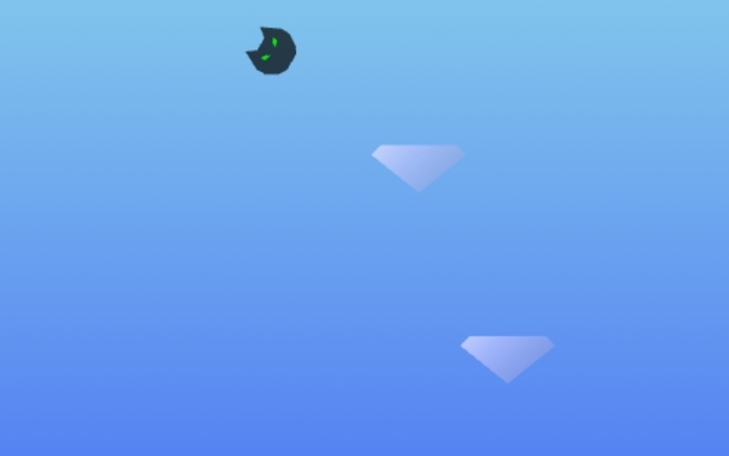

<h1><a href="https://bacionejs.github.com/furball/" style="text-decoration: none; color: inherit;">Play</a></h1>

# FURBALL 🐱💨

FURBALL is a minimalist arcade platformer where you guide a little cat leaping across floating diamond platforms in the sky.
Time your jumps carefully, keep your balance, and climb as high as you can to rack up points.  
But be careful — miss a platform and you’ll pay the price!

🎮 How to Play
- Click / Tap anywhere on the screen to make the cat jump.
- The jump’s horizontal direction and strength depend on where you tap:
- Tap on the left side → jump left.
- Tap on the right side → jump right.
- Tap closer to the middle → smaller sideways movement.
- A very faint vertical line appears in the middle to help you orient your taps.
- Land on new platforms to score points.
- Falling costs you -5 points (ouch!).

⚙️ Extra Features
- Difficulty slider: adjust the platform scroll speed (1 = easy, 10 = hard).
- Procedurally generated platforms for endless play.
- Simple retro-inspired visuals and sound.

## Credits

- **Sound Effects**  
  Created using [MiniSoundEditor](https://xem.github.io/MiniSoundEditor/) by [xem](https://xem.github.io/)  
  Sound examples by Anders Kaare

- **ChatGPT** – My virtual co-developer who never sleeps, never complains, constantly tells me I'm brilliant, and provided questionable wisdom and "perfect" code snippets.

---

# Post-mortem

I made the jump controls relative to the center of the screen. The reasoning was that if the cat was near the right edge and needed to make a long jump right, the player would have no way to tap “far enough” to send it that direction. Using the screen center seemed like the safest anchor.

In practice, though, this introduced an awkward disconnect: the player’s tap wasn’t about the cat itself but about some invisible axis in the middle of the screen. That feels unintuitive.

The better approach is to make controls relative to the cat’s position:
If you want to do a long rightward jump but you’re pinned to the right edge, you can just let the cat wrap and then perform the long jump. The “no room to tap” problem doesn’t really matter.

Lesson learned: Sometimes an over-engineered solution (anchoring to the screen center) looks necessary, but in practice, simple, player-centric controls provide a better game feel.

---

